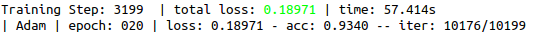
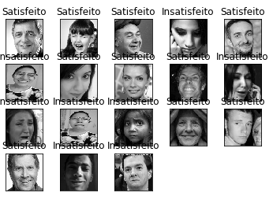

# Iliked
 Data mining project to identify customer satisfaction level.
 
## Technologies

- [x] Tensorflow
- [x] TFLearn
- [x] OpenCV
- [x] Numpy
- [x] Spyder 3.3

## Technique 

- [x] Neural network convolution

## Final Accuracy (15 epoch)

## Working

## Future goals

- [x] Recognition of more expressions
- [x] Friendly interface implementation
- [x] Relate the purchase made by the customer to your facial expression
